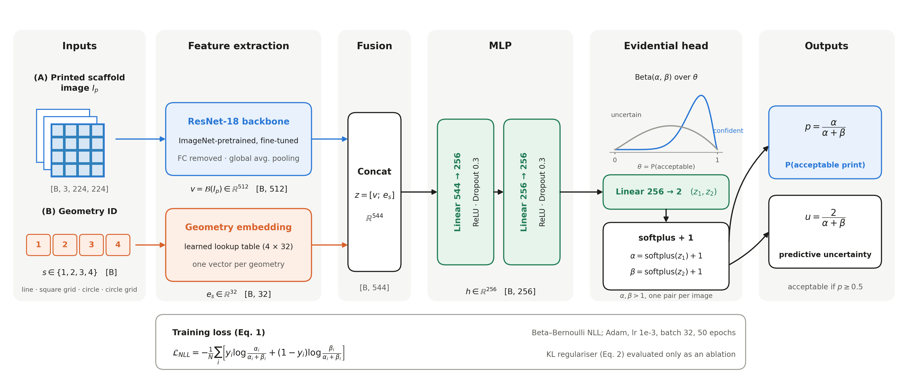

# AI-Based Quality Assessment of 3D-Bioprinted Scaffolds

Deep-learning quality control for extrusion-based 3D bioprinting. The repository holds a dataset of
**864 brightfield images** of alginate–gelatin scaffolds printed under systematically varied
parameters, each labelled **good** (acceptable) or **bad** (defective), and two models trained on it.

| | Model | Inputs | Where |
|---|---|---|---|
| **Current** | Evidential, geometry-conditioned ResNet-18 classifier with Beta output (probability + uncertainty), fully evaluated with session-grouped cross-validation, ablations and leave-one-geometry-out | printed image + geometry ID | [`evidential_qc/`](evidential_qc/) |
| Legacy | Siamese dual-backbone network comparing each print with its reference design (classification + similarity heads) | printed image + reference image | repository root (`main.py`, `model.py`, …) |

<p align="center"></p>

## Headline results (current model)

Session-grouped 5-fold cross-validation on 860 images (whole fabrication sessions held out, model
selection on training data only):

| Model | Accuracy | Balanced accuracy | ROC-AUC |
|---|---|---|---|
| Evidential geometry-conditioned ResNet-18 | **0.841 ± 0.023** | **0.846 ± 0.016** | **0.912 ± 0.031** |
| Plain ResNet-18 classifier | 0.836 ± 0.022 | 0.840 ± 0.018 | 0.909 ± 0.027 |
| MS-SSIM similarity baseline | 0.610 ± 0.041 | 0.613 ± 0.047 | 0.653 ± 0.057 |

The learned models outperform MS-SSIM by 23 percentage points; the geometry embedding and Beta head
match, but do not beat, a plain ResNet-18, and add a calibrated probability (ECE 0.039). The model
does not generalise to a geometry excluded from training. Full results, figures and reproduction
instructions: **[`evidential_qc/README.md`](evidential_qc/README.md)**.

## Quick start (current model)

```bash
git clone https://github.com/mohankumardey/AI-Based-3D-Bioprinting_Accuracy.git
cd AI-Based-3D-Bioprinting_Accuracy/evidential_qc
bash run.sh --smoke   # ~1 min check: environment, data audit, 3 short training runs
bash run.sh           # all 51 experiments (~3.5 h on an Apple M2 Pro), report and figures
```

Every table and figure can also be regenerated from the saved predictions without retraining:

```bash
cd evidential_qc
python analyze.py && python make_figures.py && python make_fig15.py --errors
```

## Dataset

```
data/
├── Good_png/            # 392 acceptable prints
├── Bad_png/             # 472 defective prints
├── IDSR_reference.png   # line pattern reference (SLA print)
├── IDSQR_reference.png  # square grid reference
├── IDCR_reference.png   # circular pattern reference
└── IDCBR_reference.png  # circular grid reference
3D_Bioprinting Features.xlsx   # printing parameters for every print ID (one sheet per geometry × tip)
```

| Filename prefix | Geometry | Needle tip |
|---|---|---|
| `IDSR` / `IDST` | Line pattern | regular / tapered |
| `IDSQR` / `ID` | Square grid | regular / tapered |
| `IDCR` / `IDCT` | Circular pattern | regular / tapered |
| `IDCBR` / `IDCB` | Circular grid | regular / tapered |

Each geometry was printed with 2 needle tips × 3 gauges (25G, 27G, 30G) × 2 temperatures × 6 speeds
(1–6 mm/s) × 3 extrusion pressures (10–80 psi) = 216 conditions, 864 in total, one print per condition.

| Geometry | Good | Bad | % good |
|---|---|---|---|
| Line pattern | 122 | 94 | 56.5 |
| Square grid | 49 | 167 | 22.7 |
| Circular pattern | 108 | 108 | 50.0 |
| Circular grid | 113 | 103 | 52.3 |

**Known data issues** (see `evidential_qc/manifest_audit.txt`): `IDSR_15.png` and `IDCT_19.png`
appear as identical files in both `Good_png` and `Bad_png` (print IDs `IDST_94` and `IDCT_30` are
missing, so these are likely misnamed); square-grid images `IDSQR_*` and `ID_1`–`ID_72` are 512 px
while all others are 256 px. The current pipeline excludes the conflicting pairs and harmonises
resolution automatically.

---

## Legacy: Siamese reference-comparison model

The code at the repository root is the earlier model: a dual-backbone network that compares a print
image against its reference image and outputs a good/bad classification and a similarity score. It
is kept for reference; `experiments/` contains one of its training runs.

### Features

- Customizable model architecture with different backbones (ResNet18, ResNet34, ResNet50, EfficientNet, MobileNet)
- Configurable similarity and classification heads
- Extensive data augmentation options
- Multiple loss function options
- Various optimizers and learning rate schedulers
- Comprehensive logging and visualization with TensorBoard
- Early stopping and model checkpointing
- Stratified data splitting for balanced training
- Batch inference on test data
- Visual result analysis

### Directory Structure

```
.
├── config_loader.py    # Configuration loading utilities
├── data_utils.py       # Dataset and data loading utilities
├── model.py            # Model architecture definitions
├── training.py         # Training and logging utilities
├── main.py             # Main training script
├── inference.py        # Inference script
└── config.json         # Configuration file
```

### Installation

1. Clone this repository
2. Install the required dependencies:

```bash
pip install torch torchvision albumentations tensorboard matplotlib seaborn scikit-learn pillow
```

### Data Preparation

Organize your data in the following structure:

```
data/
├── Bad_png/
│   ├── ID_1.png
│   ├── ID_3.png
│   └── ...
├── Good_png/
│   ├──ID_6
│   ├──ID_9
│   └── ...
└── IDCBR_reference.png
└── IDCR_reference.png
└── IDSQR_reference.png
└── IDSR_reference.png
```
### 3D Bioprinting Features

```
All bioprinting parameter features are available in the 3D bioprinting features Excel file.
```

### Configuration

The system is highly customizable through the `config.json` file. The file is divided into several sections:

1. **General Settings**: Controls the overall experiment parameters
2. **Data Settings**: Parameters for data loading and preprocessing
3. **Model Settings**: Model architecture configuration
4. **Training Settings**: Training process parameters
5. **Optimizer Settings**: Optimizer configuration
6. **Scheduler Settings**: Learning rate scheduler configuration
7. **Early Stopping**: Early stopping parameters
8. **Augmentation Settings**: Data augmentation configuration
9. **Logging Settings**: Logging and checkpoint configuration

Edit the `config.json` file to customize the system according to your needs.

### Training

To train the model with default configuration:

```bash
python main.py --config config.json
```

You can override specific configuration parameters via command line:

```bash
python main.py --config config.json --data_root /path/to/data --epochs 150 --batch_size 64 --lr 0.0005
```

The training script will:
1. Load and validate the configuration
2. Prepare the data loaders
3. Initialize the model, optimizer, and scheduler
4. Train the model for the specified number of epochs
5. Validate the model after each epoch
6. Save checkpoints and logs
7. Generate visualizations of training progress

### Inference

To run inference on a single image:

```bash
python inference.py --model path/to/model.pt --image path/to/image.png --reference path/to/reference.png --visualize
```

To run batch inference on a test dataset:

```bash
python inference.py --model path/to/model.pt --data_dir path/to/data_directory --output_dir path/to/output_directory --visualize
```

### Experiment Tracking

The system uses TensorBoard for experiment tracking. To view the training progress:

```bash
tensorboard --logdir experiments/
```

This will allow you to visualize:
- Training and validation losses
- Classification and similarity component losses
- Validation accuracy
- Learning rate changes
- Confusion matrices
- Classification reports

### Examples

#### Custom Model Configuration

To use a different backbone with custom head layers:

```json
{
    "model_architecture": "QualityControlNet",
    "backbone": "resnet50",
    "pretrained": true,
    "dropout_rate": 0.6,
    "similarity_head_layers": [2048, 1024, 512, 256, 1],
    "classification_head_layers": [2048, 1024, 512, 256, 2]
}
```

#### Learning Rate Schedule

To use cosine annealing with warm restarts:

```json
{
    "scheduler": "CosineAnnealingWarmRestarts",
    "scheduler_T_0": 10,
    "scheduler_T_mult": 2,
    "scheduler_min_lr": 1e-6
}
```

#### Custom Augmentation

To focus on specific augmentations:

```json
{
    "use_augmentation": true,
    "aug_rotate90_prob": 0.7,
    "aug_flip_prob": 0.7,
    "aug_shift_scale_rotate_prob": 0.6,
    "aug_noise_prob": 0.3,
    "aug_blur_prob": 0.1,
    "aug_color_prob": 0.4
}
```

### Advanced Usage

#### Custom Loss Weighting

Adjust the weights of the classification and similarity losses:

```json
{
    "classification_weight": 0.7,
    "similarity_weight": 1.3
}
```

#### Early Stopping Customization

Configure early stopping to be more or less aggressive:

```json
{
    "early_stopping": true,
    "early_stopping_patience": 20,
    "early_stopping_min_delta": 0.0005
}
```

### Performance Tips

1. **GPU Acceleration**: Set `"device": "cuda"` and `"pin_memory": true` for faster training on GPU
2. **Data Loading**: Adjust `"num_workers"` based on your CPU cores (typically 4-8)
3. **Batch Size**: Use the largest batch size that fits in your GPU memory
4. **Augmentation**: More augmentation helps with limited data
5. **Learning Rate**: Start with 0.001 and adjust based on training curves
6. **Early Stopping**: Use early stopping to prevent overfitting
7. **Model Size**: Smaller backbones (MobileNet) train faster but may be less accurate

### Extending the System

The modular design makes it easy to extend the system:

1. **New Backbones**: Add new backbone models in `model.py`
2. **Custom Losses**: Add new loss functions in `training.py`
3. **Additional Metrics**: Add new metrics in `ExperimentLogger.log_metrics()`
4. **Custom Schedulers**: Add new schedulers in `get_scheduler()`
