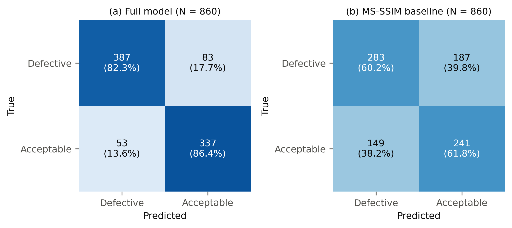
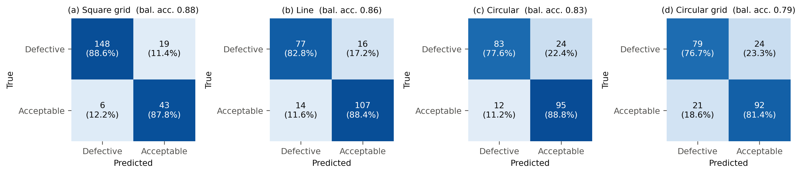
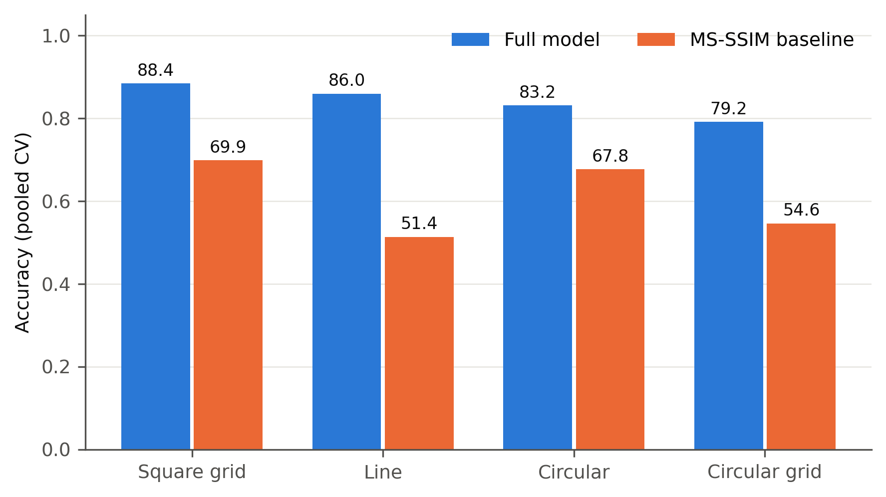
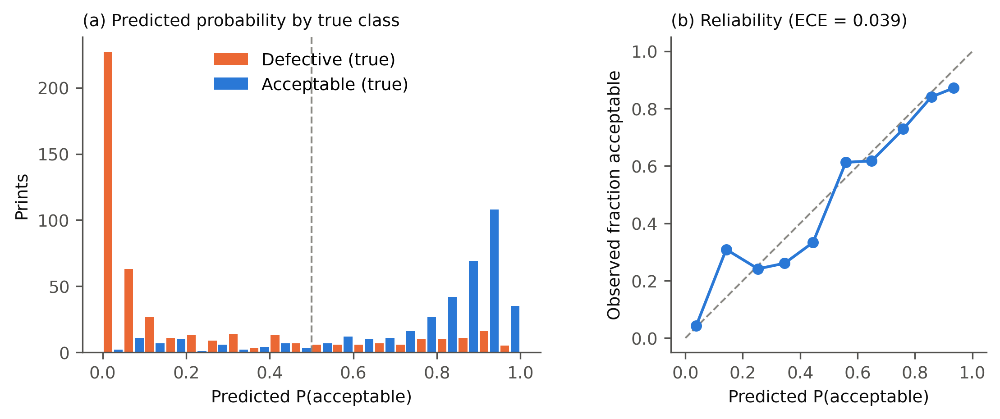
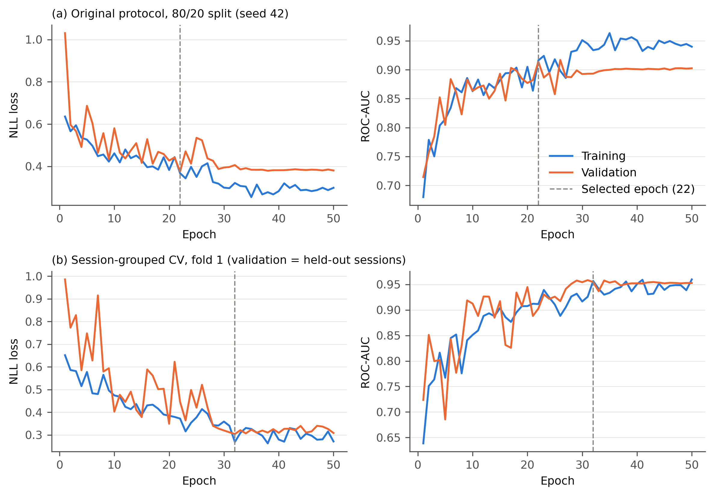
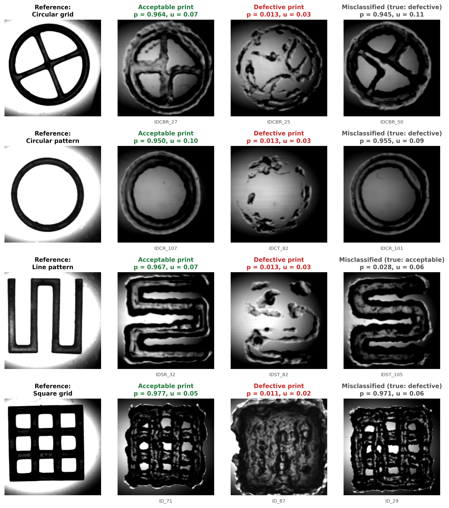

# Evidential, geometry-conditioned quality control for extrusion-bioprinted scaffolds

A single-image classifier that decides whether an extrusion-bioprinted scaffold is **acceptable** or
**defective**, given a brightfield image of the print and its geometry. It combines an ImageNet
ResNet-18 with a learned geometry embedding and an evidential **Beta** output, so every prediction
comes with a probability `p` and an uncertainty `u`.

This folder contains the model, a fully reproducible evaluation (51 training runs: original
protocol, session-grouped cross-validation with ablations, leave-one-geometry-out), an MS-SSIM
baseline, every per-image prediction, and the scripts that turn those predictions into the tables
and figures below.


## Contents

- [Results at a glance](#results-at-a-glance)
- [Model](#model)
- [Dataset](#dataset)
- [Evaluation protocols](#evaluation-protocols)
- [Results](#results)
- [Reproducing everything](#reproducing-everything)
- [Repository layout](#repository-layout)
- [Output formats](#output-formats)
- [Implementation details](#implementation-details)
- [Limitations](#limitations)

## Results at a glance

Session-grouped 5-fold cross-validation, 860 images, test sessions never seen in training or model selection:

| Model | Accuracy | Balanced acc. | ROC-AUC |
|---|---|---|---|
| **Full model** (ResNet-18 + 32-d geometry embedding + Beta head) | **0.841 ± 0.023** | **0.846 ± 0.016** | **0.912 ± 0.031** |
| Plain ResNet-18 classifier (no geometry, no Beta head) | 0.836 ± 0.022 | 0.840 ± 0.018 | 0.909 ± 0.027 |
| MS-SSIM similarity baseline | 0.610 ± 0.041 | 0.613 ± 0.047 | 0.653 ± 0.057 |

- The learned model is **23 percentage points more accurate than MS-SSIM** (McNemar p < 0.001).
- It is **statistically indistinguishable from a plain ResNet-18** (p = 0.65). Neither the geometry
  embedding nor the Beta head improves accuracy; the Beta head adds a calibrated probabilistic
  output (expected calibration error 0.039).
- The uncertainty `u = 2/(α+β)` flags errors (ROC-AUC 0.75), but no better than the predicted probability itself.
- The model **does not transfer to a geometry absent from training** (balanced accuracy 0.49–0.74).

## Model

`model.py`, class `QCNet`.

| Stage | Details | Output |
|---|---|---|
| Image backbone | ResNet-18, ImageNet weights, final FC removed, **fine-tuned end to end** | `v ∈ R^512` |
| Geometry embedding | `nn.Embedding(4, 32)` over line / square grid / circle / circle grid | `e_s ∈ R^32` |
| Fusion | concatenation `z = [v; e_s]` | `R^544` |
| MLP | Linear 544→256, ReLU, Dropout 0.3, Linear 256→256, ReLU, Dropout 0.3 | `h ∈ R^256` |
| Evidential head | Linear 256→2 → `α = softplus(z1)+1`, `β = softplus(z2)+1` | `α, β > 1` |
| Outputs | `p = α/(α+β)` (P(acceptable)), `u = 2/(α+β)` (subjective-logic uncertainty, K = 2) | |

Trainable parameters: **11,382,466** (backbone 11,176,512; embedding 128; MLP 205,312; head 514).

**Loss.** Beta–Bernoulli negative log-likelihood:

```
L_NLL = −(1/N) Σ_i [ y_i log(α_i/(α_i+β_i)) + (1 − y_i) log(β_i/(α_i+β_i)) ]
```

It depends only on the ratio α/β, so it does not directly train the total evidence α+β. An optional
KL regulariser (Sensoy et al., 2018) pulls the evidence for the wrong class towards Beta(1,1):
`L = L_NLL + λ_t · KL[Beta(α̃, β̃) ‖ Beta(1,1)]` with `α̃ = y + (1−y)α`, `β̃ = (1−y) + yβ` and
`λ_t` annealed 0→1 over 10 epochs. It is evaluated as an ablation (`full_kl`) and is not part of the
main model.

**Ablation variants** (`run_experiments.py`, switches `geom` and `head` in `QCNet`):

| Name | Geometry input | Head / loss |
|---|---|---|
| `resnet_bce` | none | 1 logit, binary cross-entropy |
| `resnet_geom_bce` | 32-d embedding | 1 logit, binary cross-entropy |
| `resnet_beta` | none | Beta, NLL |
| `full` | 32-d embedding | Beta, NLL |
| `full_onehot` | 4-d one-hot | Beta, NLL |
| `full_embed8` | 8-d embedding | Beta, NLL |
| `full_kl` | 32-d embedding | Beta, NLL + KL |
| `full_frozen` | 32-d embedding, backbone frozen | Beta, NLL |

## Dataset

The images and print parameters are in this repository (`../data`, `../3D_Bioprinting Features.xlsx`).
`build_manifest.py` maps every file to its geometry, needle tip, print ID, printing parameters and
fabrication session, and audits the data (`manifest.csv`, `manifest_audit.txt`).

**Design.** For each of four geometries: 2 needle tips (regular, tapered) × 3 gauges (25G, 27G, 30G) ×
2 temperatures (30/35 °C regular, 25/30 °C tapered) × 6 speeds (1–6 mm/s) × 3 pressures (per gauge
and temperature, 10–80 psi) = **216 conditions per geometry, 864 in total**, each printed once.

| Geometry | Acceptable | Defective | % acceptable |
|---|---|---|---|
| Line pattern | 122 | 94 | 56.5 |
| Square grid | 49 | 167 | 22.7 |
| Circular pattern | 108 | 108 | 50.0 |
| Circular grid | 113 | 103 | 52.3 |
| **All** | **392** | **472** | **45.4** |

**Data issues found by the audit** (handled automatically):

- `IDSR_15.png` and `IDCT_19.png` are byte-identical files present in **both** `Good_png` and `Bad_png`;
  print IDs `IDST_94` and `IDCT_30` are missing, so these are probably misnamed. The four files are
  excluded from cross-validation and leave-one-geometry-out (**860 usable images**).
- Images come at two resolutions: 512 px for all `IDSQR_*` and `ID_1`–`ID_72`, 256 px otherwise.
  Resolution correlates with label and session, so all images are downsampled to 256 px before
  training (`harmonize=True`), except in the original-protocol runs.
- **Fabrication session** = one tip × gauge × temperature block of 18 prints (48 sessions). Print
  dates are not part of the dataset, so this is a proxy for print runs.

## Evaluation protocols

| Group | Runs | Protocol |
|---|---|---|
| `repro` | 3 (seeds 42–44) | **Original protocol**: single 80/20 split stratified on geometry × label, all 864 files, no resolution harmonisation, checkpoint chosen on the same 20% it is scored on (optimistic by design). |
| `cv` | 8 variants × 5 folds | **Session-grouped 5-fold CV** (`StratifiedGroupKFold`, groups = sessions, stratified on geometry × label). Checkpoint and LR schedule use an inner session-held-out split carved from the training fold; the test fold is never used during training or model selection. |
| `logo` | 2 variants × 4 | **Leave-one-geometry-out**: train on three geometries (inner session-held-out split for selection), test on every print of the fourth. |
| MS-SSIM | – | Grayscale 256 px MS-SSIM (Wang et al., 2003) against each geometry's reference image; per-geometry threshold by Youden's J on the training images of each fold. |

Leakage controls: duplicate files removed by MD5; sessions never split across train/test;
augmentation on the fly for training images only; no replicates exist; resolution harmonised;
reference images are never model inputs.

**Metrics** (`metrics.py`; positive class = acceptable print, threshold 0.5): accuracy, balanced
accuracy, sensitivity, specificity, precision, F1, ROC-AUC, Brier score, ECE (10 bins), and for
Beta models the error-detection AUC of `u` compared with the same statistic for `−|p − 0.5|`.
Models are compared on identical test images with an exact McNemar test and 2,000-sample bootstrap
95% CIs (`analyze.py`). **Every number here is recomputed from saved per-image predictions**, never
from training logs.

## Results

The complete, auto-generated report is [`report/REPORT.md`](report/REPORT.md); tables are also saved as CSV in `report/`.

### Cross-validated ablation (mean ± SD over 5 folds; counts pooled)

| Variant | Accuracy | Balanced acc. | Sensitivity | Specificity | ROC-AUC | ECE | TP/TN/FP/FN |
|---|---|---|---|---|---|---|---|
| MS-SSIM | 0.610 ± 0.041 | 0.613 ± 0.047 | 0.622 | 0.604 | 0.653 | – | 241/283/187/149 |
| `resnet_bce` | 0.836 ± 0.022 | 0.840 ± 0.018 | 0.871 | 0.810 | 0.909 | 0.085 | 339/380/90/51 |
| `resnet_geom_bce` | 0.821 ± 0.025 | 0.822 ± 0.030 | 0.851 | 0.793 | 0.900 | 0.096 | 334/372/98/56 |
| `resnet_beta` | 0.829 ± 0.022 | 0.835 ± 0.019 | 0.867 | 0.803 | 0.904 | 0.099 | 337/376/94/53 |
| **`full`** | **0.841 ± 0.023** | **0.846 ± 0.016** | 0.865 | 0.826 | **0.912** | 0.084 | 337/387/83/53 |
| `full_onehot` | 0.795 ± 0.044 | 0.798 ± 0.051 | 0.800 | 0.796 | 0.889 | 0.112 | 313/372/98/77 |
| `full_embed8` | 0.803 ± 0.024 | 0.810 ± 0.020 | 0.839 | 0.780 | 0.895 | 0.100 | 325/365/105/65 |
| `full_kl` | 0.809 ± 0.051 | 0.815 ± 0.046 | 0.804 | 0.826 | 0.912 | 0.122 | 310/386/84/80 |
| `full_frozen` | 0.758 ± 0.070 | 0.761 ± 0.065 | 0.750 | 0.773 | 0.841 | 0.104 | 291/362/108/99 |

### Paired comparisons against the full model (same 860 test images)

| Comparison | Only A right | Only full right | McNemar p | Δ accuracy [95% CI] | Δ AUC [95% CI] |
|---|---|---|---|---|---|
| MS-SSIM → full | 66 | 266 | < 0.001 | +0.232 [+0.194, +0.273] | +0.256 [+0.215, +0.297] |
| `resnet_bce` → full | 37 | 42 | 0.65 | +0.006 [−0.014, +0.026] | +0.002 [−0.010, +0.015] |
| `resnet_geom_bce` → full | 39 | 57 | 0.08 | +0.021 [−0.001, +0.044] | +0.015 [−0.001, +0.031] |
| `resnet_beta` → full | 34 | 45 | 0.26 | +0.013 [−0.007, +0.033] | +0.009 [−0.004, +0.022] |
| `full_onehot` → full | 42 | 81 | < 0.001 | +0.046 [+0.021, +0.071] | +0.030 [+0.013, +0.047] |
| `full_embed8` → full | 29 | 63 | < 0.001 | +0.039 [+0.017, +0.060] | +0.022 [+0.009, +0.036] |
| `full_kl` → full | 34 | 62 | 0.006 | +0.032 [+0.010, +0.055] | +0.023 [+0.009, +0.038] |

Each variant was trained once per fold, and these tests capture test-image variation only, not
training randomness. Because a one-hot code feeding a linear layer can represent anything a learned
embedding can, treat the embedding-size differences as unconfirmed until repeated with more seeds.

### By geometry (full model, pooled CV)

| Geometry | Balanced acc. | Sensitivity | Specificity | ROC-AUC | MS-SSIM accuracy | Model accuracy |
|---|---|---|---|---|---|---|
| Square grid | 0.882 | 0.878 | 0.886 | 0.948 | 0.699 | 0.884 |
| Line pattern | 0.856 | 0.884 | 0.828 | 0.910 | 0.514 | 0.860 |
| Circular pattern | 0.832 | 0.888 | 0.776 | 0.895 | 0.678 | 0.832 |
| Circular grid | 0.791 | 0.814 | 0.767 | 0.858 | 0.546 | 0.792 |

<p align="center"></p>
<p align="center"></p>
<p align="center"></p>

### Calibration and uncertainty

Pooled CV: ECE 0.039, Brier 0.122. Mean `u` is 0.33 on errors vs 0.19 on correct predictions.

| Variant | Error-detection AUC of `u` | Same using only −\|p − 0.5\| | corr(`u`, \|p − 0.5\|) |
|---|---|---|---|
| `resnet_bce` (no `u`) | – | 0.772 | – |
| `resnet_beta` | 0.754 | 0.756 | −0.972 |
| `full` | 0.748 | 0.753 | −0.977 |
| `full_kl` | 0.750 | 0.752 | −1.000 |

Because α, β ≥ 1, a confident `p` requires a large α+β, so `u` is almost a deterministic function
of `p`. It is useful for routing prints to manual review, but carries no extra information.

<p align="center"></p>

### Leave-one-geometry-out

| Held-out geometry | `full` balanced acc. | `full` ROC-AUC | `resnet_beta` balanced acc. | `resnet_beta` ROC-AUC |
|---|---|---|---|---|
| Circular pattern | 0.738 | 0.872 | 0.598 | 0.768 |
| Circular grid | 0.587 | 0.774 | 0.500 | 0.723 |
| Line pattern | 0.500 | 0.784 | 0.500 | 0.671 |
| Square grid | 0.489 | 0.668 | 0.488 | 0.749 |

On an unseen geometry the model mostly predicts a single class. The ranking is partly kept
(AUC 0.67–0.87), so re-fitting the threshold on a few labelled prints may help, but new geometries
need labelled examples.

### Original single-split protocol (3 seeds, 173 test images each)

| Seed | Accuracy | Balanced acc. | Sensitivity | Specificity | ROC-AUC | TP/TN/FP/FN |
|---|---|---|---|---|---|---|
| 42 | 0.832 | 0.840 | 0.924 | 0.755 | 0.914 | 73/71/23/6 |
| 43 | 0.832 | 0.838 | 0.899 | 0.777 | 0.921 | 71/73/21/8 |
| 44 | 0.850 | 0.848 | 0.823 | 0.872 | 0.928 | 65/82/12/14 |
| **Mean ± SD** | **0.838 ± 0.010** | 0.842 ± 0.005 | 0.882 | 0.801 | **0.921 ± 0.007** | |

This protocol selects the checkpoint on the scored split, yet gives almost the same result as the
stricter cross-validation: performance holds on unseen fabrication sessions.

### Training curves and qualitative examples



Examples from out-of-fold predictions: reference, most confident correct acceptable and defective
prints, and the most confident error per geometry (`figures/fig15_qualitative_picks.csv` lists the files).

<p align="center"></p>

## Reproducing everything

Requirements: Python ≥ 3.10, PyTorch ≥ 2.2 with torchvision (Apple-Silicon MPS, CUDA or CPU).

```bash
cd evidential_qc
bash run.sh --smoke     # ~1 min: creates .venv, audits the data, trains 3 runs for 2 epochs
bash run.sh             # all 51 runs (~3.5 h on an M2 Pro), then report/ and figures/
```

`run.sh` is resumable: finished runs (those with a `preds.csv`) are skipped, so rerun it after an
interruption. Use `PY=/path/to/python bash run.sh` to reuse an existing environment.

Individual steps:

```bash
python build_manifest.py                      # manifest.csv + audit (reads ../data)
python run_experiments.py --only cv --variants full resnet_bce   # a subset
python msssim_baseline.py --out results       # CPU, seconds
python analyze.py --results results --out report
python make_figures.py && python make_fig5.py && python make_fig15.py --errors
```

All analysis and figure scripts are torch-free and run from the saved predictions in `results/`, so
the tables and figures can be regenerated without retraining.

## Repository layout

```
evidential_qc/
├── build_manifest.py     # file → geometry/tip/print ID/parameters/session; data audit
├── splits.py             # original split, session-grouped CV, inner validation, leave-one-geometry-out
├── model.py              # QCNet (geometry × head variants), Beta-Bernoulli NLL, KL regulariser
├── train.py              # data pipeline, augmentation, training loop, per-image predictions
├── run_experiments.py    # the 51-run experiment plan (resumable)
├── msssim_baseline.py    # MS-SSIM baseline on the same splits
├── metrics.py            # metric definitions (torch-free)
├── analyze.py            # tables, paired tests, report/REPORT.md (torch-free)
├── make_figures.py       # training curves, confusion matrices, per-geometry, calibration
├── make_fig5.py          # architecture diagram
├── make_fig15.py         # qualitative examples from out-of-fold predictions
├── run.sh                # one-command reproduction
├── requirements.txt
├── manifest.csv, manifest_audit.txt
├── results/              # per-run preds.csv, history.csv, meta.json; MS-SSIM scores; training_log.txt
├── report/               # REPORT.md + CSV tables + diagnostic plots
└── figures/              # publication figures (PNG/PDF/SVG)
```

## Output formats

Each run directory (`results/<group>/<variant>/<fold or seed>/`) contains:

- `preds.csv`: one row per test image: `path, label, geometry, tip, prefix, print_id, session, p`,
  plus `u, alpha, beta` for Beta-head models. Written last, so its presence marks a finished run.
- `history.csv`: per-epoch learning rate, KL weight, training loss/accuracy/AUC, and loss/accuracy/AUC on the model-selection split.
- `meta.json`: configuration, seed, device, split sizes, selected epoch, parameter counts, torch version, runtime.

`results/msssim_scores.csv` holds the MS-SSIM score of every image; `msssim_cv_preds.csv` and
`msssim_paper_split_preds.csv` hold the thresholded predictions (`margin` = score − geometry
threshold, used for AUC).

## Implementation details

| Setting | Value |
|---|---|
| Input | RGB, resized to 224 × 224, ImageNet normalisation (256 px harmonisation first in CV/LOGO) |
| Augmentation | random 90° rotation, horizontal and vertical flips (always); affine ±15°, ±10% shift, 0.9–1.1 scale (p = 0.5); colour jitter brightness/contrast 0.2, saturation 0.15 (p = 0.5); Gaussian blur σ 0.5–1.5 (p = 0.2); Gaussian noise σ 0.02 (p = 0.2); multiplicative noise 0.8–1.2 (p = 0.2); motion blur 3–7 px (p = 0.1) |
| Sampler | `WeightedRandomSampler` balanced over geometry × label |
| Optimiser | Adam, lr 1e-3, no weight decay, batch 32, 50 epochs |
| Scheduler | ReduceLROnPlateau on selection-split loss (factor 0.1, patience 5, min lr 1e-6) |
| Checkpoint | lowest selection-split loss |
| Decision threshold | 0.5 |
| Hardware / time | Apple M2 Pro (MPS), ~4 min per 50-epoch run, ~3.5 h for all 51 runs |
| Software | torch 2.11, torchvision 0.26, Python 3.12 |

## Limitations

- Each condition was printed once, and sessions are a tip × gauge × temperature proxy, not recorded print runs.
- Scaffolds are 0.5–1.0 mm high (one or two layers): the model assesses deposition fidelity of low-layer prints, not the integrity of thick multilayer constructs.
- Image sharpness varies across the dataset; resolution is harmonised, but other acquisition differences may remain.
- No generalisation to unseen geometries; all claims refer to the four geometries in the training data.
- Ablation variants were trained with one seed per fold.

## References

- K. He et al., *Deep residual learning for image recognition*, CVPR 2016.
- M. Sensoy, L. Kaplan, M. Kandemir, *Evidential deep learning to quantify classification uncertainty*, NeurIPS 2018.
- A. Jøsang, *Subjective Logic: A Formalism for Reasoning Under Uncertainty*, Springer, 2016.
- Z. Wang, E. P. Simoncelli, A. C. Bovik, *Multiscale structural similarity for image quality assessment*, Asilomar 2003.
- Q. McNemar, *Note on the sampling error of the difference between correlated proportions or percentages*, Psychometrika 12(2), 1947.
